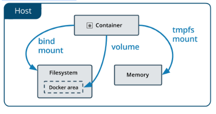
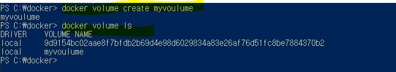
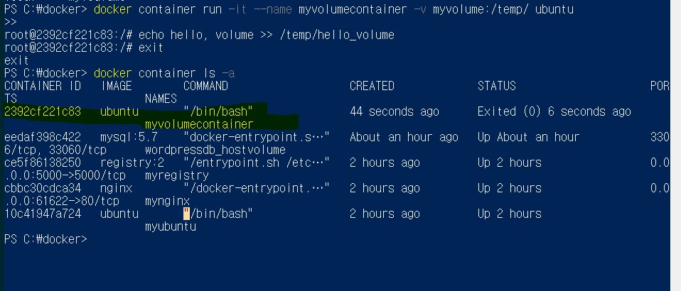
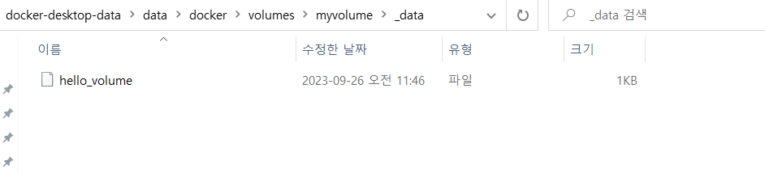

## 도커에서 데이터 관리



## volume
- 호스트의 파일 시스템 내에 특정 영역(리눅스의 경우, /var/lib/docker/volumes/)을 도커가 사용, 관리
- 도커가 아닌 다른 프로세스에서는 해당 영역 접근이 불가능 
- 가장 추천하는 방식

    1. 볼륨생성
        - 
    2. 생성한 볼륨을 사용하는 컨테이너를 실행
        - 
    3. docker inspect 명령으로 볼륨의 저장 위치를 확인
        - 
        - 윈도우에서 볼륨 위치
        ```
        wsl.localhost\docker-desktop-data\data\docker\volumes\myvolume
        ```
        - 

## bind mount
- 호스트의 파일 시스템 자체를 사용 
- 호스트와 컨테이너가 설정 파일을 공유하거나 호스트에서 개발하고 컨테이너로 배포하는 방식으로 사용 


## tmpfs mount
- 호스트의 파일 시스템 대신 메모리에 저장하는 방식
- non-persistant data를 다룰 때는 tmpfs mount가 가장 중요
    - on-persitant data는 로그인할 때의 password 같은 유지될 필요 없는 데이터


