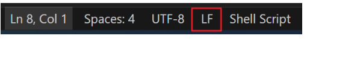
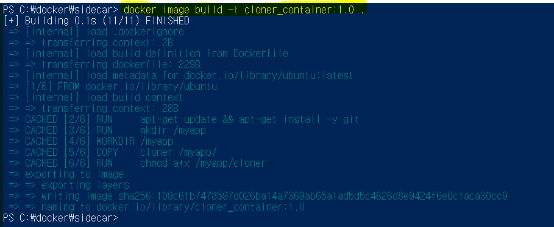
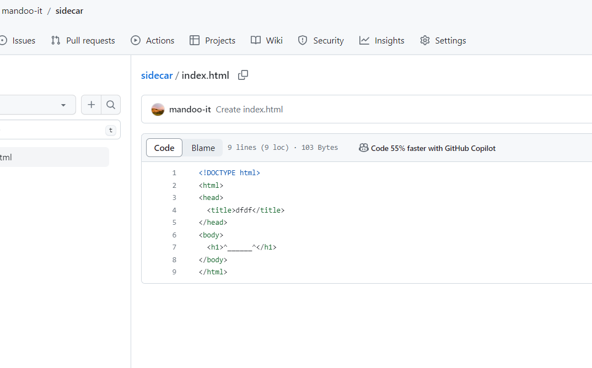
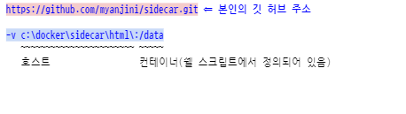
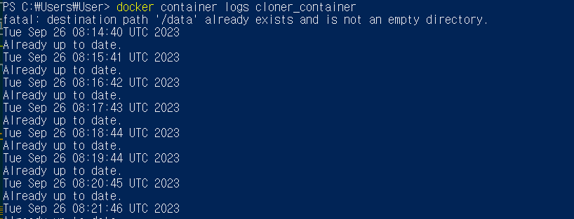
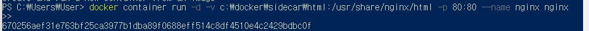
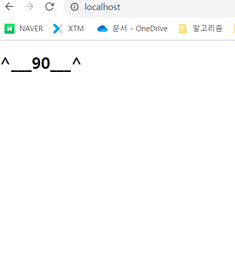

2# 최신 컨텐츠를 제공하는 웹 애플리케이션 서버

```
[ 요구사항 ] 

두 개의 컨테이너로 구성된 어플리케이션을 개발

1. 첫번째 컨테이너는 주기적으로 깃 허브에서 컨텐츠(HTML)를 다운로드하는 쉘 스크립트가 동작
깃 허브 주소는 컨테이너는 실행할 때 환경 변수로 전달 받아서 사용한다. 

2. 두번째 컨테이너는 첫번째 컨테이너를 사용하여 nginx 서버가 동작하게한다. 
 
```

#### 1. 작업 디렉터리 생성

``` shell
C:\docker> mkdir sidecar
C:\docker> cd sidecar
C:\docker\sidecar>
```


#### 2. cloner 파일을 작성 ⇐ 깃 허브로부터 60초 단위로 컨텐츠를 가져오는 쉘 스크립트 


``` shell
#!/bin/bash

# GITHUB_URL 환경변수가 설정되어 있는지 확인 
# 설정되지 않은 경우 에러 종료
if [ -z $GITHUB_URL ]; then
    exit 1
fi

# 처음에는 git clone을 통해서 컨텐츠를 가져옮
git clone $GITHUB_URL /data

# 이후에는 60초 마다 깃 허브에서 컨텐츠를 가져옮
cd /data
while true
do
    date
    sleep 60
    git pull
done

```
- 주의 할 점 : 리눅스 개행문자로 바꿔줘야 쉘스크립트가 제대로 작동한다. 


#### 3. Dockerfile 작성
``` docker
FROM    ubuntu
RUN     apt-get update && apt-get install -y git
RUN     mkdir /myapp
WORKDIR /myapp
COPY    cloner /myapp/
RUN     chmod a+x /myapp/cloner
CMD     [ "/myapp/cloner" ]

```


#### 4. 이미지 빌드



#### 5. git에 레포지토리 생성


#### 5. 첫번째 컨테이너 실행 
- git clone 후 1분 단위로 git pull 하는지 확인

    ``` powershell
    docker container run -d -e GITHUB_URL=https://github.com/mandoo-it/sidecar.git -v c:\docker\sidecar\html\:/data --name cloner_container cloner_container:1.0
    ```

    

#### 5. 컨테이너 로그 확인
- 5에서 --name 옵션으로 컨테이너 이름을 지정해줘서 로그를 확인 할 수 있다. 
    ```
    docker container logs cloner_container
    ```
    

    - 1분에 한번씩 git pull이 잘 되는 것으로 확인된다. 

#### 6. 두번째 컨테이너 실행 ⇒ nginx 이미지를 이용해서 컨테이너를 실행 (호스트와 컨테이너의 서비스 포트를 동일하게 설정)



#### 6. 웹 서버 실행화면 


- git의 index.html를 바꾸면 1분 뒤 바뀐다. 