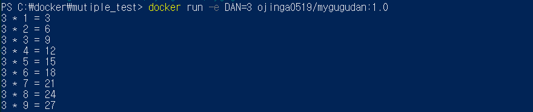
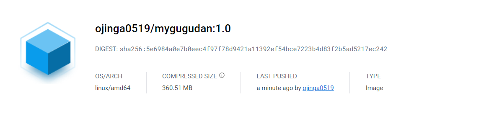
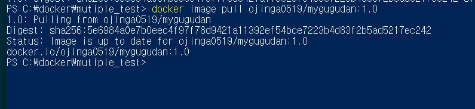
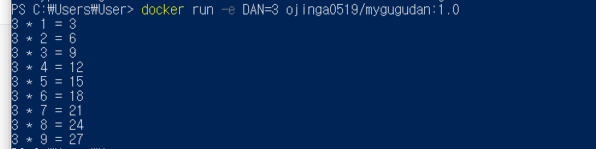

# 실습 1

```
구구단을 출력하는 파이썬 프로그램을 작성하고, 해당 프로그램을 실행하는 도커 컨테이너 이미지를 생성 후 본인의 도커 허브에 등록하시오. 

- 컨테이너 이미지 이름은 mygugudan:1.0으로 한다.

- 컨테이너를 실행할 때 환경변수의 값으로 출력한 단을 지정하고, 만약 환경변수를 부여하지 않으면 2 ~ 9단까지 모두 출력하도록 한다. 
```

#### 1. 작업 디렉터리 생성

c:\docker> mkdir mutiple_test

c:\docker> cd mutiple_test

#### 2. 구구단을 출력하는 파이썬 프로그램을 작성

```python
import os

### DAN 이라는 환경변수 값을 가져온다
num = os.environ.get('DAN')

### 환경변수를 INT로 변환해야 계산이 가능하다
if num is not None:
    for i in range(1,10):
        print(f"{num} * {i} = {int(num) * i}")
else:
    for i in range(2,10):
        for j in range(1,10):
            print(f"{i} * {j} = {i*j}")
```

#### 3. Dockerfile 작성
```
FROM    python
RUN     mkdir /myapp
WORKDIR /myapp
COPY    gugudan.py  .
CMD     ["python", "gugudan.py"]
```


#### 4. 이미지 빌드


#### 5. 컨테이너 실행


- e 옵션을 사용하여 환경변수 값 지정


#### 6. 이미지 등록


#### 6. 이미지 확인 



#### 7. 이미지 받아서 컨테이너 구동

다른 pc에서도 잘 구동이 되는 것이 확인된다. 
