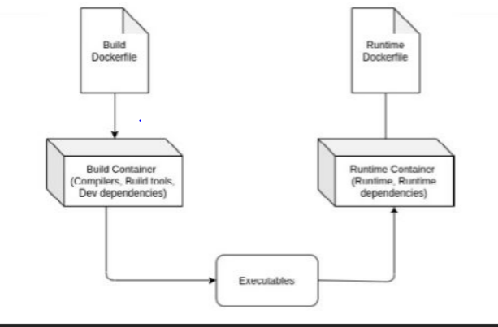

## Dockerfile 작성 시 유의사항 2

- Dockerfile을 작성할 때 명령어를 묶어서 실행하는 것이 유익
- 빌더 패턴 또는 다단계 도커 빌드 등을 기법을 이용해서 이미지를 작게 만드는 것이 필요

  #### 레이어 최소화


  - RUN 지시문을 결합해서 최적화 ⇒ Dockerfile의 각 줄은 도커 이미지에서 공간을 차지할
    새 레이어를 생성하므로 가능한 한 지시문을 결합해서 적은 레이어를 생성

  #### 불필요한 도구 설치 금지

  - 불필요한 개발 및 디버깅 도구(vim, curl, telnet, ... 등)와 종속성을 제거하면 크기가 작은 효율적인 도커 이미지를 생성할 수 있음
    ```
    --no-install-recommends 플래그를 사용
    ```

  #### apt 패키지 매지저의 캐시 삭제

## 빌더 패턴과 다단계 도커 빌드

### 빌더 패턴

- 최적 크기 도커 이미지를 생성하기 위해 사용하는 방법
- 두 개의 도커 이미지를 사용

  - 첫 번째 도커 이미지 ⇒ Builder ⇒ 소스 코드를 실행 파일로 만들기 위한 빌드 환경 ⇒ 빌드에 필요한 컴파일러, 빌드 도구, 개발 종속성 등을 포함
  - 두 번째 도커 이미지 ⇒ Runtime ⇒ 첫 번째 도커 컨테이너가 생성한 실행 파일을 실행하기 위한 런타임 환경 ⇒ 실행 파일, 종속성 및 런타임 도구만 포함
  - 첫 번째 도커 컨테이너가 생성한 실행 파일을 두 번째 도커 컨테이너로 전달하는 스크립트가 필요



## 빌드 컨텍스트(build context)

- 도커 이미지를 생성하는데 필요한 파일, 소스 코드, 메타 데이터 등을 담고 있는 디렉터리
- Dockerfile이 존재하는 디렉터리
- 빌드 컨텍스트는 docker build 명령어의 마지막에 지정한 위치에 있는 파일 전체를 포함
- 깃 허브과 같은 외부 URL에서 Dockerfile을 읽어 들인다면 해당 저장소에 있는 파일과 서브 모듈을 포함
- .dockerignore 파일을 작성하면 명시된 이름의 파일을 빌드 시 컨텍스트에서 제외시킨다.
  - 불필요한 파일 → 빌드 시간을 단축하고 네트워크 대역폭을 절약
  - 기밀성을 요하는 파일
  - .dockerignore 파일은 Dockerfile과 동일한 위치에 저장
