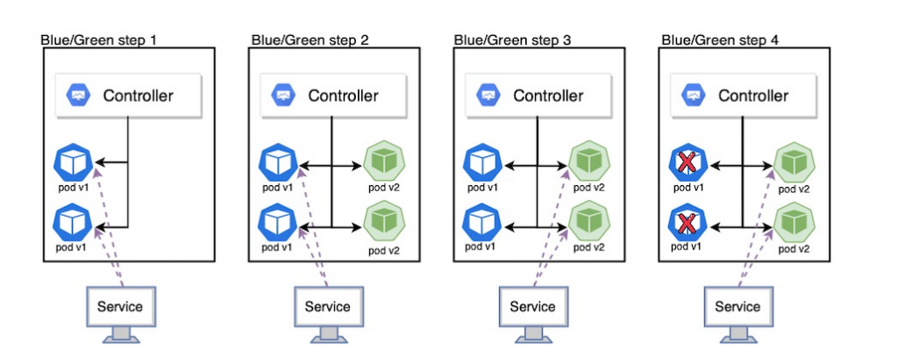
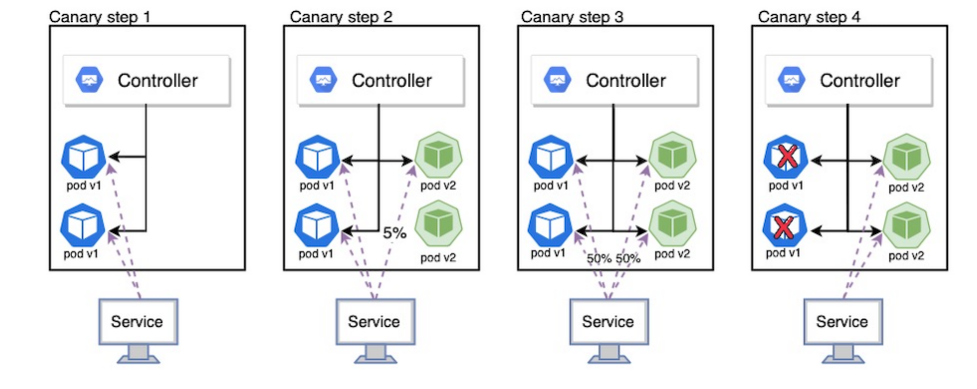

## 쿠버네티스 배포 전략

- 예전에는 서비스 업데이트를 대대적으로 릴리즈 했지만 , 최근에는 micro service로 자주 배포하는 형식으로 변함
- 무중단 배포 -> 배포할 때 기존의 서비스를 종료하고 새 서비스를 배포할 때까지 다운타임이 생기는게, 이를 없애기 위한 전략 
- <b><i>Rolling update, Blue/green deployment, Canaray Release </b></i> 3가지 방식이 있다

### Rolling Update
- 사용 중인 인스턴스 내에서 새 버전을 점진적으로 교체

```yaml
apiVersion: apps/v1
kind: Deployment
metadata:
  name: sample-deployment-rollingupdate
spec:
  strategy:
    type: RollingUpdate			// 전략 종류 
    rollingUpdate:				
      maxUnavailable: 0			// 업데이트 중 동시에 정지 가능한 최대 파드 수
      maxSurge: 1				// 업데이트 중 동시에 생성할 수 있는 최대 파드 수 
  replicas: 3				     maxUnavailable과 maxSurge를 모두 0으로 설정할 수는 없음
  selector:
    matchLabels:
      app: sample-app
  template:
    metadata:
      labels:
        app: sample-app
    spec:
      containers:
      - name: nginx-container
        image: docker.io/nginx:1.16
      imagePullSecrets:
      - name: regcred


```
```
NAME                                        DESIRED   CURRENT   READY   AGE
sample-deployment-rollingupdate-9ff76c956   3         3         3       42s		# 업데이트 전
sample-deployment-rollingupdate-77dc8d9fb   1         0         0       0s		# 새로운 파드 추가
sample-deployment-rollingupdate-77dc8d9fb   1         0         0       0s
sample-deployment-rollingupdate-77dc8d9fb   1         1         0       0s
sample-deployment-rollingupdate-77dc8d9fb   1         1         1       2s		# 새로운 파드 1개 완료
sample-deployment-rollingupdate-9ff76c956   2         3         3       2m4s	# 이전 서비스 1개 감소
sample-deployment-rollingupdate-77dc8d9fb   2         1         1       2s		# 신규 1 추가
sample-deployment-rollingupdate-9ff76c956   2         3         3       2m4s
sample-deployment-rollingupdate-77dc8d9fb   2         1         1       2s
sample-deployment-rollingupdate-9ff76c956   2         2         2       2m4s		
sample-deployment-rollingupdate-77dc8d9fb   2         2         1       2s
sample-deployment-rollingupdate-77dc8d9fb   2         2         2       4s
sample-deployment-rollingupdate-9ff76c956   1         2         2       2m6s		#5 이전 서비스 1개 감소
sample-deployment-rollingupdate-77dc8d9fb   3         2         2       4s
sample-deployment-rollingupdate-9ff76c956   1         2         2       2m6s
sample-deployment-rollingupdate-9ff76c956   1         1         1       2m6s
sample-deployment-rollingupdate-77dc8d9fb   3         2         2       4s		#6 신규 2 추가
sample-deployment-rollingupdate-77dc8d9fb   3         3         2       4s
sample-deployment-rollingupdate-77dc8d9fb   3         3         3       6s
sample-deployment-rollingupdate-9ff76c956   0         1         1       2m8s		#7 이전 서비스 1개 감소
sample-deployment-rollingupdate-9ff76c956   0         1         1       2m8s
sample-deployment-rollingupdate-9ff76c956   0         0         0       2m8s

```


### Blue/green deployment
- 새로운 변경사항이 포함된 어플리케이션을 위한 독립된 새로운 환경을 구축하고 교체하는 방법
- 이전 버전과 새로운 버전이 공존하는 시간이 존재함을 없애줘서 장점이지만, 자원이 그만큼 많이 필요한 단점이 있다. 

출처 : https://nearhome.tistory.com/106

### Canaray Release

-가동 중인 서버들의 일부에만 새로운 앱을 배포하여, 일부 트래픽을 새 버전의 환경으로 분산하는 방법

출처 : https://nearhome.tistory.com/106