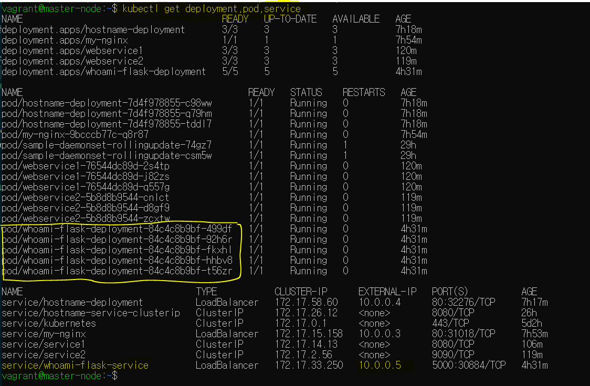

# 실습 

```
아래 조건을 만족하는 플라스크 애플리케이션을 개발하고 쿠버네티스 클러스터에 배포해 보세요. 

플라스크 애플리케이션은 /whoareyou 요청에 대해 작성자 이름, 호스트 이름, IP 주소를 반환
예) 홍길동, hostname-deployment-7d4f978855-2kkw6, 10.0.0.4

플라스크 애플리케이션을 구동하는 컨테이너 이미지의 이름은 whoami-flask:v1 으로 설정해 본인의 도커 허브에 등록

디플로이먼트의 레플리카는 5개로 설정해서 배포하고, LoadBalancer 타입의 서비스를 이용해서 디플로이먼트를 연동

```

#### 1. 프로젝트 셋업

```shell
python -m venv whoami-flask
cd whoami-flask
Scripts\activate
pip install flask
code .
``` 


#### 2. 플라스크 애플리케이션 제작


```python
from flask import Flask
import os
import socket


app = Flask(__name__)


@app.route('/whoareyou')
def whoareyou():
    name = '홍길동'
    host_name = socket.gethostname()
    host_ip = socket.gethostbyname(host_name)
   
    return name + " : " + host_name + " : " + host_ip


app.run(host="0.0.0.0",port=5000)

```

#### 3. test
```
python app.py
```


#### 4. Dockerfile 생성
- requirements.txt 파일 생성
    

- Dockerfile 생성
``` Dockerfile
FROM     python
WORKDIR  /app
COPY     app.py .
COPY     requirements.txt .
RUN      pip install -r requirements.txt
CMD      ["python", "/app/app.py"]

```


#### 5. 이미지 빌드 및 등록


#### 6. 디플로이먼트와 서비스 매니페스트 파일 작성
*** metallb 가 설치된 환경에서 #6 절차를 수행해야 함 -> EXTERNAL_IP생성 하여 외부에서 접속가능하게 하기위해
``` yaml
apiVersion: apps/v1
kind: Deployment
metadata:
  name: whoami-flask-deployment
spec:
  replicas: 5
  selector:
    matchLabels:
      app: whoami-flask
  template:
    metadata:
      name: whoami-flask-pod
      labels:
        app: whoami-flask
    spec:
      containers:
      - name: whoami-flask-container
        image: docker.io/ojinga0519/whoami-flask:v1
        ports:
        - containerPort: 5000
      imagePullSecrets:
      - name: regcred
---
apiVersion: v1
kind: Service
metadata:
  name: whoami-flask-service
spec:
  type: LoadBalancer
  ports:
  - name: whoami-flask
    port: 5000
    targetPort: 5000
  selector:
    app: whoami-flask


```


#### 7.  디플로이먼트와 서비스 생성



metallb 때문에 EXTERNAL_IP가 생성되는 것을 볼 수 있다. 

#### 8.  로드밸런서 IP로 접근했을 때 다섯 개의 파드로 요청이 분배되는 것을 확인

디폴리먼트파일에서 replicas 수를 5로 설정해서 다섯개 파드 생성

 
